# 🧪 EPROJECT – API TEST RESULTS (POSTMAN)

📁 **Ảnh test Postman** nằm trong thư mục:

---

## 🔐 AUTH SERVICE (`/auth`)
### 🧩 Đăng ký tài khoản
**✅ register.png** – Tạo tài khoản mới thành công.  
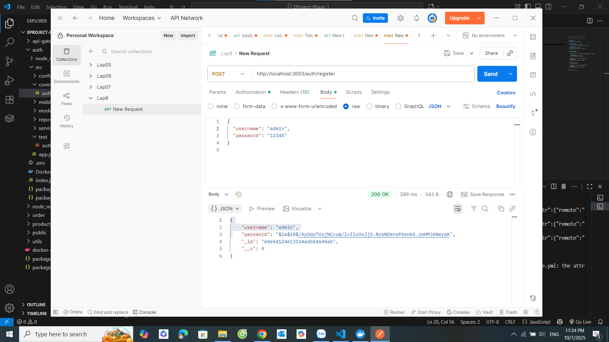

**❌ register-exist.png** – Tên tài khoản đã tồn tại, trả về 400.  
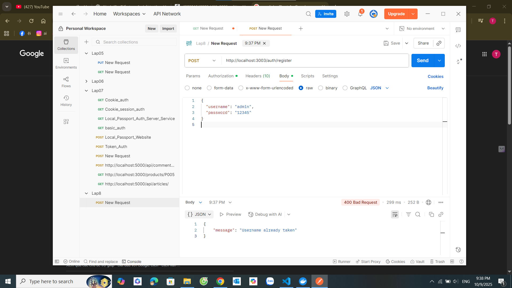

---

### 🧩 Đăng nhập hệ thống
**✅ login.png** – Đăng nhập thành công, trả về token JWT.  
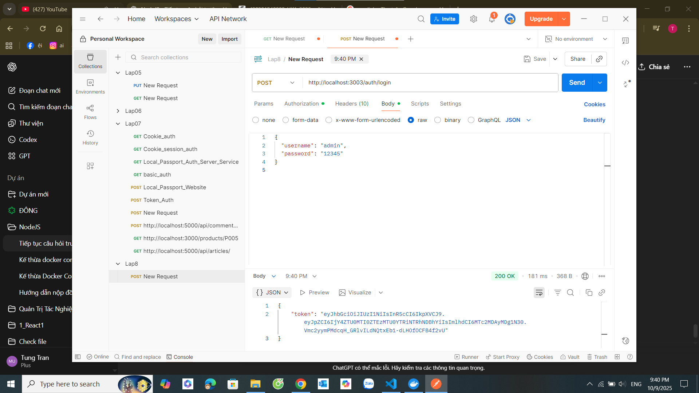

**❌ login-fail.png** – Sai mật khẩu, trả về 401 Unauthorized.  
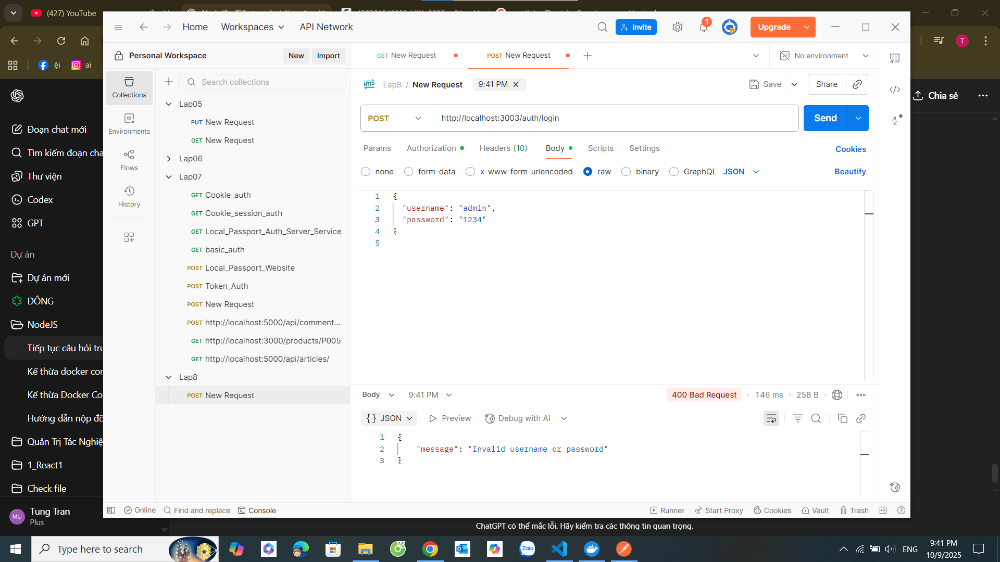

---

## 🛍 PRODUCT SERVICE (`/products`)
### 🧩 Tạo sản phẩm mới
**✅ createProduct.png** – Tạo sản phẩm thành công với đầy đủ thông tin.  
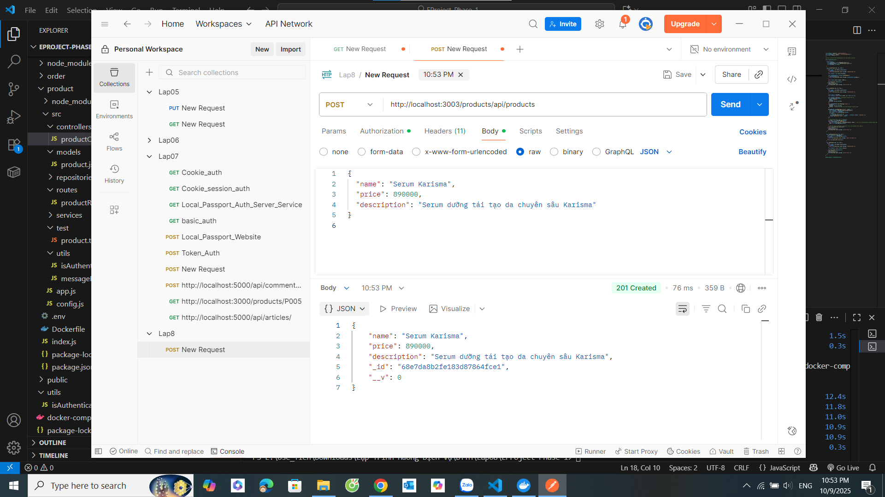

**❌ createProduct-failToken.png** – Thiếu token → 401 Unauthorized.  

**❌ createProduct-requiredName.png** – Thiếu trường `name` → 400 Bad Request.  

**❌ createProduct-requiredPrice.png** – Thiếu trường `price` → 400 Bad Request.  

---

### 🧩 Lấy danh sách sản phẩm
**✅ getProducts.png** – Lấy danh sách tất cả sản phẩm thành công.  
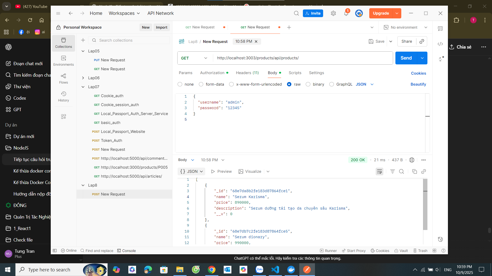

**❌ getProducts-failToken.png** – Thiếu token khi gọi API → 401 Unauthorized.  
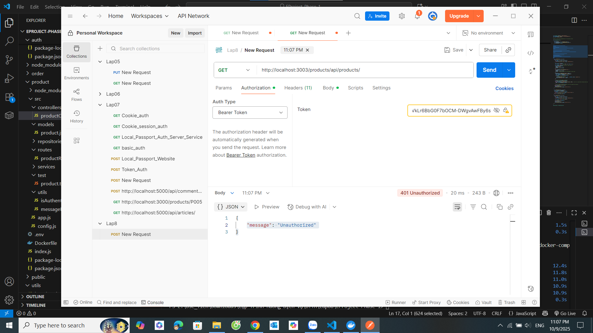

---

## 📦 ORDER SERVICE (`/buy`, `/status/:orderId`)
### 🧩 Tạo đơn hàng
**✅ createOrder.png** – Mua hàng thành công, trả về `orderId` duy nhất.  
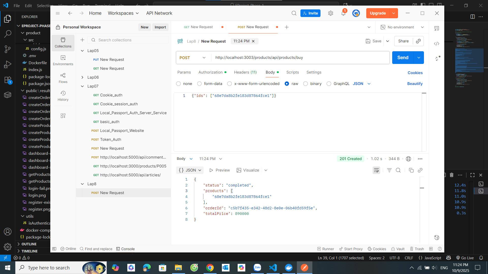

**❌ createOrder-failed.png** – Gửi body rỗng hoặc sai định dạng `ids` → lỗi xử lý.  
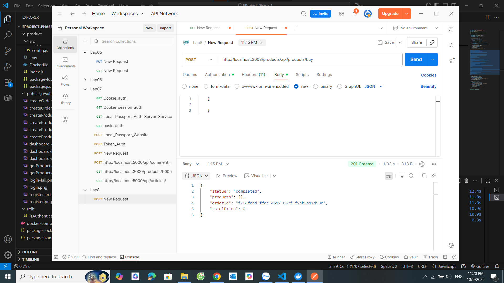

**❌ createOrder-failToken.png** – Thiếu token → 401 Unauthorized.  
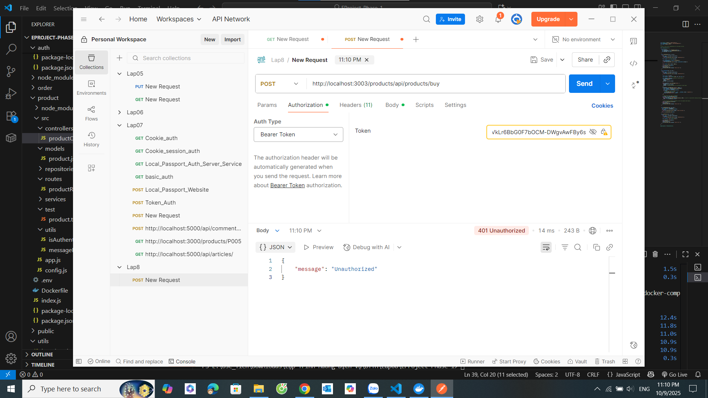

**❌ createOrder-serverError.png** – Lỗi máy chủ khi tạo đơn (500).  
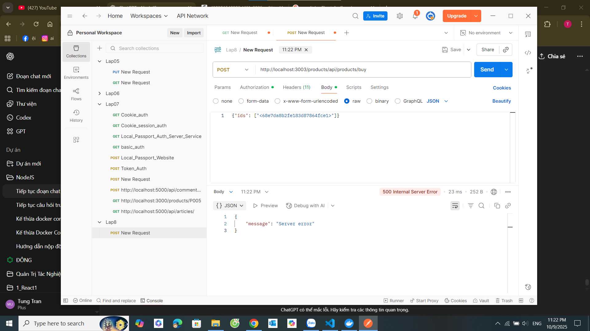

---

### 🧩 Kiểm tra trạng thái đơn hàng
**❌ getOrderStatus.png** *(chưa có ảnh hoặc đang 404 do ordersMap reset)*  
> Khi test thành công, chụp màn hình trả về JSON trạng thái đơn hàng và thêm vào thư mục `/public/results/`.

---

## 📊 DASHBOARD / TOKEN VALIDATION
**✅ dashboard-success.png** – Truy cập Dashboard hợp lệ với token đúng.  
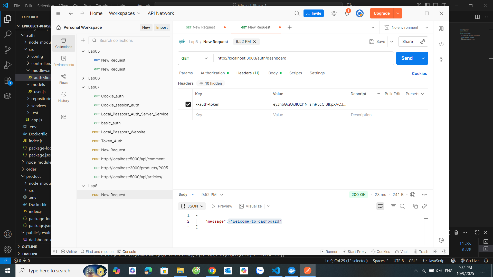

**❌ dashboard-denied.png** – Không có token → truy cập bị từ chối.  
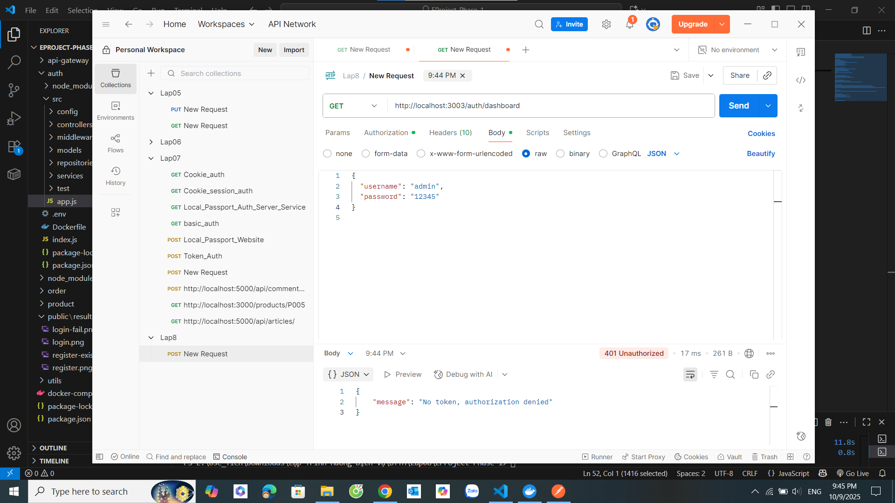

**❌ dashboard-invalid.png** – Token không hợp lệ → 403 Forbidden.  
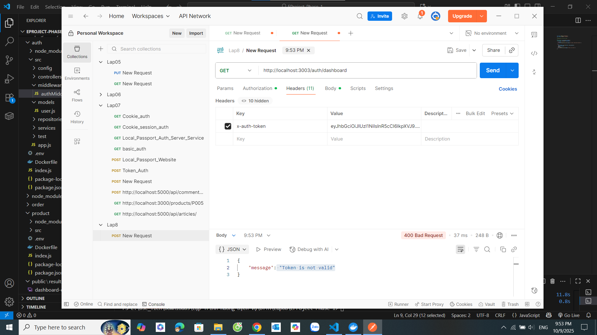

---

## 🧾 TỔNG KẾT TEST

| Nhóm API | Pass | Fail | Ghi chú |
|-----------|------|------|---------|
| Auth | ✅ 2 | ⚠️ 1 | Kiểm tra logic đăng ký & đăng nhập ổn định |
| Products | ✅ 2 | ⚠️ 3 | Đã bắt được lỗi thiếu trường & token |
| Orders | ✅ 1 | ⚠️ 3 | Cần cải thiện kiểm tra `ordersMap` |
| Dashboard | ✅ 1 | ⚠️ 2 | Token validation hoạt động chính xác |

---

## 💬 Ghi chú
- Toàn bộ test thực hiện bằng **Postman** trên địa chỉ: http://localhost:3003/

- Các API yêu cầu `Authorization: Bearer <token>` đều dùng token lấy từ endpoint `/auth/login`.
- `ordersMap` lưu tạm trong RAM nên sẽ mất khi restart service → cần gọi GET status **ngay sau khi mua**.
- Ảnh test nằm tại thư mục `public/results/` để minh chứng kết quả từng API.

---

**© 2025 – EProject NodeJS Microservices (Auth / Product / Order)**  
*Thực hiện bởi [Trần Chí Tiến – 22707291]*  

